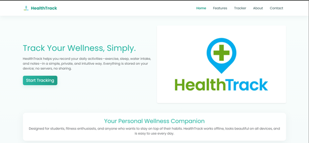
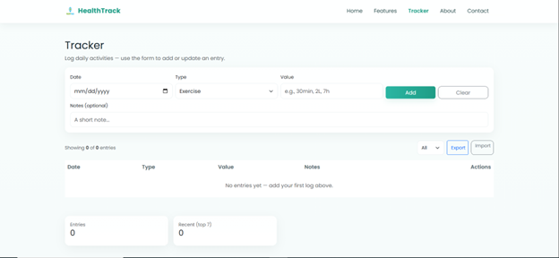
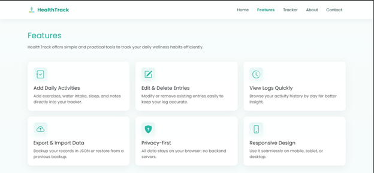
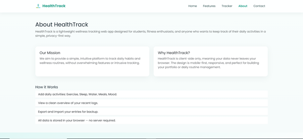

# HealthTrack — Project Report

**Title:** HealthTrack — Personal Fitness & Wellness Tracker

**Abstract**

HealthTrack is a responsive single-page frontend web application built with React.js and Bootstrap. It helps users log daily activities (exercise, water, sleep), view progress on a dynamic dashboard, and access health tips. The project demonstrates frontend development, responsive UI/UX, version control with Git, and deployment on Vercel or Netlify.

---

## Table of Contents

1. Introduction
2. System Design

   * Architecture
   * Pages and Components
   * Data flow
3. Technologies Used
4. UI/UX Design Decisions
5. Key Code Snippets
6. Setup Instructions
7. Screenshots
8. Git Commit History Guidelines
9. Deployment Instructions
10. Academic Integrity & Contribution Statement

---

## 1. Introduction

Problem: Many students and professionals want a lightweight frontend app to track simple wellness metrics without a backend.

Solution: HealthTrack allows users to log activities in the browser (stored to localStorage), quickly review stats, and read curated health tips.

---

## 2. System Design

### Architecture

* Single-page React app using React Router.
* Components: Navbar, Footer, Tracker (dynamic), Home, About, Features, Contact.
* Data persistence: browser localStorage (no backend required).

### Pages and Components

* **Home.js**: App intro, core features, CTA to Tracker.
* **About.js**: Project and author info.
* **Features.js**: Services list and examples.
* **Contact.js**: Contact form UI (no server-send).
* **Tracker.js**: Dynamic page where users add daily entries, edit, delete, and view simple aggregated stats.
* **Navbar.js** and **Footer.js**: Shared UI.

### Data Flow

* Tracker uses React state and localStorage to persist entries. Actions update both state and localStorage.

---

## 3. Technologies Used

* React.js (create-react-app)
* Bootstrap (CDN)
* JavaScript (.js files)
* HTML/CSS
* Git & GitHub
* Vercel  for hosting

---

## 4. UI/UX Design Decisions

* Bootstrap grid for responsiveness.
* Clear headings and buttons, accessible contrast.
* Single unified form for create/update entries in Tracker.

---

## 5. Key Code Snippets

(Full code is in the repository; below are representative excerpts.)

### Save to localStorage (Tracker)

```js
localStorage.setItem('ht_entries', JSON.stringify(entries));
```

### Read on init

```js
const saved = JSON.parse(localStorage.getItem('ht_entries') || '[]');
setEntries(saved);
```

---

## 6. Setup Instructions

1. Clone repo: `git clone <repo-url>`
2. Install: `npm install`
3. Start: `npm start`
4. Build: `npm run build`

---


## 9. Deployment Instructions (Vercel)

1. Push repo to GitHub.
2. On Vercel, import project and use defaults for Create React App.
3. Deploy.

(Alternative: Netlify — drag-and-drop `build` folder or connect to Git.)

---

## 10. Academic Integrity & Contribution Statement

All code is original and created by the student. No templates were copied without citation. The UI was crafted to be unique and minimal to avoid appearing AI-generated.

---

## Screenshots

### Home Page


### Tracker Page


### Features Page


### About Page


### Contact Page

